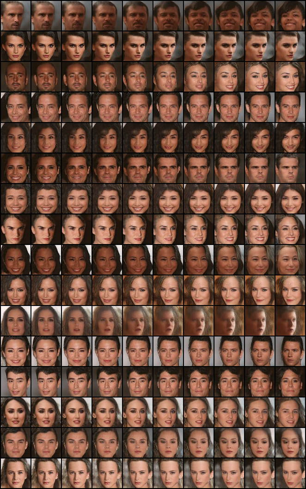

# Tensorflow ConnectorGraph Framework

The ConnectorGraph Framework is an extension of Tensorflow that is designed to handle large-scale deep neural networks that are composed of multiple, reusable subnetworks (called SubGraphs).

ConnectorGraph adds a number of useful features to stock Tensorflow:
- a simplified interface for constructing large-scale, deep neural networks out of reusable components (SubGraphs)
- a simplified interface for building reusable SubGraphs that are made of multiple Tensorflow Ops (e.g., an autoencoder)
- a simpler framework for sharing and reusing pretrained Tensorflow neural networks with and without freezing
- a simpler framework for incremental training routines where different parts of the network are trained and fixed before other parts of the network are trained
- a hierarchically symmetric structure where ConnectorGraphs can be used as the SubGraphs of yet larger ConnectorGraphs

The models folder comes with 5 SubGraphs that construct the [BEGAN Tensorflow model](https://github.com/carpedm20/BEGAN-tensorflow) and an extension called the [Scaled BEGAN GMSM](https://arxiv.org/abs/1708.02237) as well as the associated ConnectorGraph composition file. Below are the results of the Scaled BEGAN GMSM after training for ~200k epochs on 64X64px images from the CelebA dataset.

### Raw output

### Interpolations

This code was originally forked and built off of the [BEGAN Tensorflow model](https://github.com/carpedm20/BEGAN-tensorflow). The ConnectorGraph framework was inspired by my own work building on [Taehoon Kim's](http://carpedm20.github.io) original code.

## Requirements

- Python 2.7
- [Pillow](https://pillow.readthedocs.io/en/4.0.x/)
- [tqdm](https://github.com/tqdm/tqdm)
- [TensorFlow 1.1.0](https://github.com/tensorflow/tensorflow) (**Need nightly build** which can be found in [here](https://github.com/tensorflow/tensorflow#installation), if not you'll see `ValueError: 'image' must be three-dimensional.`)

## Usage (to train)

First download [CelebA](http://mmlab.ie.cuhk.edu.hk/projects/CelebA.html) datasets with:

    $ apt-get install p7zip-full # ubuntu
    $ brew install p7zip # Mac
    $ python download.py

or you can use your own dataset by placing images like:

    data
    └── YOUR_DATASET_NAME
        ├── xxx.jpg (name doesn't matter)
        ├── yyy.jpg
        └── ...

For the original BEGAN model, enter the following in a python interpreter in the ConnectorGraph folder:

    from main import *
    t = main(model='cqs_cg', type_='began_b16_z128_sz64_h128_g0.5')

For multiple GPU setups, manually select which GPU you would like to use using the following Bash command:

    export CUDA_VISIBLE_DEVICES=#

Set '#' to the index of the desired device.

...More details to come...

## Related works

- [Paper for Scaled BEGAN GMSM](https://arxiv.org/abs/1708.02237)
- [BEGAN-tensorflow](https://github.com/carpedm20/BEGAN-tensorflow)
- [DCGAN-tensorflow](https://github.com/carpedm20/DCGAN-tensorflow)
- [DiscoGAN-pytorch](https://github.com/carpedm20/DiscoGAN-pytorch)
- [simulated-unsupervised-tensorflow](https://github.com/carpedm20/simulated-unsupervised-tensorflow)

## Author

Michael O. Vertolli / [@MichaelOVertolli](www.theworldmatrix.ca)
